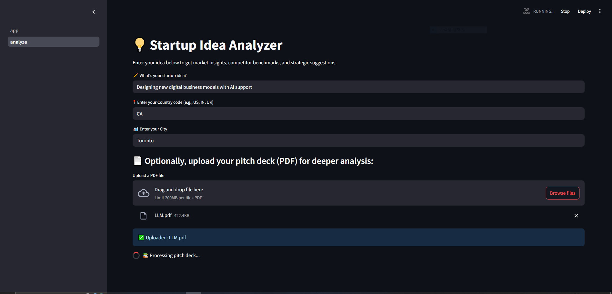
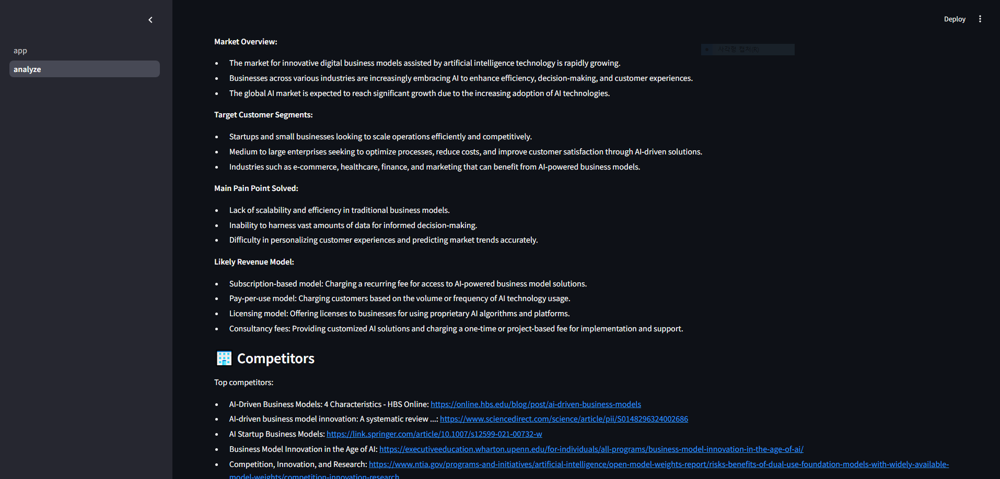
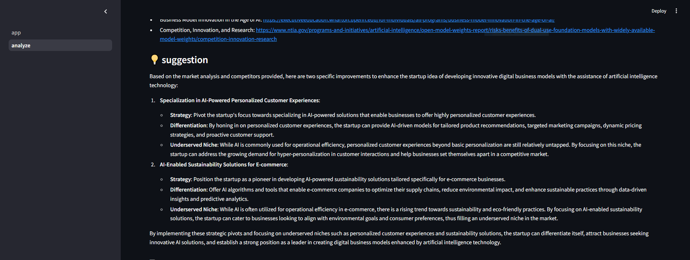

# 🚀 Upstart AI – Startup Idea Evaluator Agent

Upstart AI is an intelligent, agent-like assistant that helps startup founders analyze, refine, and validate their business ideas using Large Language Models (LLMs), real-time market data, and semantic search.

---

## ✨ Features

- 🧠 **LLM-Powered Evaluation** – Uses GPT-4 to analyze your startup idea with structured insights:
  - Market overview
  - Target customer segments
  - Pain points solved
  - Revenue model
- 🌐 **Live Competitor Analysis** – Fetches real-time competitor data via SerpAPI (Google Search).
- 📚 **Document-Aware Feedback (RAG)** – Accepts PDF pitch decks and uses vector search to enhance LLM responses.
- 🧠 **Semantic Memory** – Compares your idea to previous sessions using FAISS + sentence-transformers.
- 📊 **Clear Structured Output** – Returns readable suggestions and context, ready for business planning or pitch refining.
- 🖥 **Streamlit UI** – Simple interactive interface with dark-themed landing screen and background video.

---

## 🛠 Tech Stack

- **LLMs**: OpenAI API (GPT-4 / GPT-3.5)
- **Semantic Search**: SentenceTransformers, FAISS
- **Web Search**: SerpAPI
- **Frontend**: Streamlit + Custom CSS
- **RAG**: Retrieval-Augmented Generation over logs + uploaded PDFs

---

## 🧪 Demo Instructions

### 1. Clone the repository

```bash
git clone https://github.com/yourname/upstart-ai.git
cd upstart-ai
2. Install dependencies
pip install -r requirements.txt
3. Set up your API keys
Create a .env file in the root directory:
OPENAI_API_KEY=your_openai_key
SERPAPI_KEY=your_serpapi_key
4. Launch the app
streamlit run app.py
```
---
🔄 How It Works
1) Enter your startup idea (e.g., "Uber for dog walkers")

2) Optionally upload a PDF pitch deck

3) The app:
  -  Clarifies the idea using GPT
  -  Analyzes market potential and segments
  -  Retrieves competitors via SerpAPI
  -  Searches past sessions and PDF with semantic search
  -  Suggests specific pivots or improvements

4) All results are shown in structured output with confidence scores
---

---
✅ Skills Demonstrated
-LLM Orchestration & Prompt Engineering

-Multi-step agent reasoning

-Semantic vector search (FAISS + sentence-transformers)

-Retrieval-Augmented Generation (RAG)

-Real-time API integration (SerpAPI)

-Streamlit frontend with CSS-based layout and video background

-File processing and in-memory caching

-JSON logging and session context memory

---


---
Let me know if you'd like:
- A matching `requirements.txt` file
- A small GIF badge or screenshot for the top
- A one-line description for GitHub repo tagline or LinkedIn portfolio
---


## Additional Screenshot

Here is another page from the app:




## Additional Output

Here is the second output:




